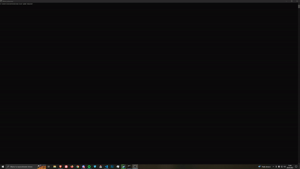
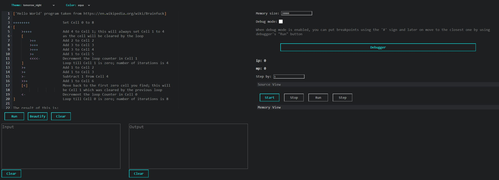
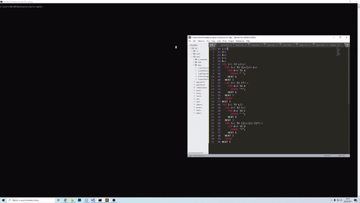
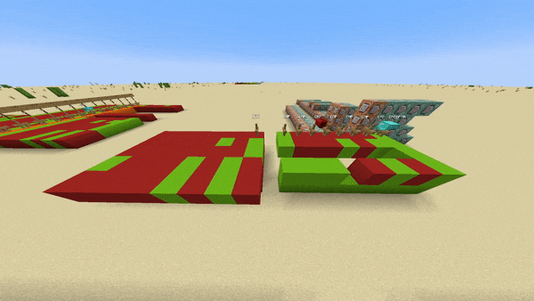

I've got some experience in C/C++

# Projects

❌ Unsatisfied with  
➖ May pick it up  
🚧 In-progress  
✔️ Satisfied with

Tutorials:
- 🚧 [opengl-2d-tutorial](https://www.github.com/kvbc/opengl-2d-tutorial)

Tools / Libraries:
- ✔️ [win-web-klgr](https://www.github.com/kvbc/win-web-klgr)
- 🚧 [mpmp](https://www.github.com/kvbc/mpmp)
- ➖ [ofp](https://www.github.com/kvbc/ofp)
- ✔️ [cwma](https://www.github.com/kvbc/cwma)
- ➖ [jctl](https://www.github.com/kvbc/jctl)
- ✔️ [cmdblocks](https://www.github.com/kvbc/cmdblocks)
- ✔️ [tsgen](https://www.github.com/kvbc/tsgen)
- ✔️ [epic](https://www.github.com/kvbc/epic)

Graphics Programming:
- ➖ [graph](https://www.github.com/kvbc/graph)
- 🚧 [maincraft](https://www.github.com/kvbc/maincraft)
- 🚧 [glez](https://www.github.com/kvbc/glez)

Compilers / Interpreters:
- 🚧 [SMPL](https://www.github.com/kvbc/smpl)
- ✔️ [brackets](https://www.github.com/kvbc/brackets) 
- ✔️ [bf2c](https://www.github.com/kvbc/bf2c)
- ✔️ [char](https://www.github.com/kvbc/char)
- ✔️ [cl-cinp](https://www.github.com/kvbc/cl-cinp)
- ❌ [factoreh](https://www.github.com/kvbc/factoreh)

Command-line:
- 🚧 [cge](https://www.github.com/kvbc/cge)
- ✔️ [128tetris](https://www.github.com/kvbc/128tetris)
- ✔️ [bittactoe](https://www.github.com/kvbc/bittactoe)
- ✔️ [c-snake](https://www.github.com/kvbc/c-snake)
- ✔️ [hangman](https://www.github.com/kvbc/hangman)
- ✔️ [tic-tac-toe](https://www.github.com/kvbc/tic-tac-toe)
- ❌ [cmd-calculator](https://www.github.com/kvbc/cmd-calculator)

Games / Plugins:
- ❌ [godot-game](https://www.github.com/kvbc/godot-game)
- ❌ [jnc-showdown](https://www.github.com/kvbc/jnc-showdown)
- ✔️ [MineCommand](https://www.github.com/kvbc/MineCommand)
- ✔️ [InfiniteRedstone](https://www.github.com/kvbc/InfiniteRedstone)
- ✔️ [EndlessDragon](https://www.github.com/kvbc/EndlessDragon)
- ❌ [space_shooter](https://www.github.com/kvbc/space_shooter)

Sites:
- ✔️ [bf-ide](https://www.github.com/kvbc/bf-ide)
- ⚠️ [cda-show-search](https://www.github.com/kvbc/cda-show-search)
- ✔️ [user-login-app](https://www.github.com/kvbc/user-login-app)
- ✔️ [boolean_simplifier](https://www.github.com/kvbc/boolean_simplifier)

# Some wicked stuff 

- cge - an Windows command-line rendering engine with double-buffering (in-progress)

- bf-ide - online customizable BrainFuck interpreter + debugger

- SMPL - full-blown BASIC compiler (in-progress)

- lamp - minecraft CPU

